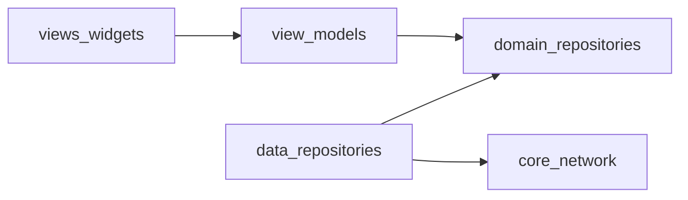

# MVVM + Repository 레이어 구조 (레이어 우선)

## 현재 상태 요약

- 네트워크·엔드포인트·토큰: [`frontend/lib/providers/api_provider.dart`](frontend/lib/providers/api_provider.dart)의 `UrlClass` → `ApiProvider`, 일부는 [`UserInfoProvider`](frontend/lib/providers/state_provider.dart)와 상속으로 결합.
- 도메인별 API 호출: `ToiletProvider`, `BookmarkProvider`, `ReviewProvider` 등이 `ApiProvider`를 **상속**해 구현됨 ([`toilet_provider.dart`](frontend/lib/providers/toilet_provider.dart) 참고).
- UI 상태·검색·설정 등 다수 `ChangeNotifier`가 한 파일에 모여 있음: [`state_provider.dart`](frontend/lib/providers/state_provider.dart) (550+ 줄).
- 화면은 `Provider`/`context.read`로 위 클래스들에 직접 의존 ([`main_screen.dart`](frontend/lib/screens/main_screen.dart) 등).

목표는 **의존성 방향**을 `presentation → domain ← data`로 고정하고, View(Widget)는 ViewModel(또는 그 래퍼)만 바라보게 하는 것입니다.

## 권장 디렉터리 트리

`lib/` 아래를 다음처럼 두는 것을 권장합니다. (패키지 import 경로는 `pubspec`의 `name`에 맞춰 조정)

```text
lib/
  core/                          # 프레임워크·앱 전역 횡단 관심사
    config/                      # env, 상수
    network/                     # Dio BaseOptions, 인터셉터(401 refresh), 공통 에러 타입
    di/                          # (선택) 수동 생성자 주입 헬퍼, 나중에 get_it 등으로 확장 가능
  domain/                        # 비즈니스 규칙의 “경계”
    entities/                    # (선택) 지금의 model과 동일하게 시작해도 됨
    repositories/                # 추상 Repository 인터페이스만 (예: ToiletRepository)
  data/                          # 데이터 출처 구현
    datasources/
      remote/                    # Dio 호출 단위 (ToiletRemoteDataSource 등)
      local/                     # SecureStorage, SharedPreferences 래퍼
    repositories/                # domain 인터페이스 구현체 (Remote + Local 조합)
    mappers/                     # (선택) JSON ↔ entity 매핑이 복잡해지면 분리
  presentation/                  # MVVM의 VM + View
    view_models/                 # ChangeNotifier / AsyncNotifier 등 (기존 *Provider 역할)
      auth_session_view_model.dart
      toilet_list_view_model.dart
      ...
    views/                       # Screen 위젯 (기존 screens/)
    widgets/                     # 화면 전용 위젯이 많아지면 여기로, 공통은 아래 shared로
  shared/                        # 레이어에 속하지 않는 순수 UI·유틸
    widgets/                     # 기존 lib/widgets/
    theme/                       # style 등 (기존 utilities 중 UI 관련)
    utils/                       # 기존 utilities 중 순수 함수
  main.dart
```

**이름 규칙 (MVVM에 맞추기)**

| 역할           | 권장 위치                                                                  | 예시                                              |
| -------------- | -------------------------------------------------------------------------- | ------------------------------------------------- |
| **View**       | `presentation/views/`, `shared/widgets/`                                   | `MainScreen`                                      |
| **ViewModel**  | `presentation/view_models/`                                                | `MainSearchViewModel` (기존 `MainSearchProvider`) |
| **Model**      | `domain/entities/` 또는 기존 유지 후 점진 이동                             | `ToiletModel`                                     |
| **Repository** | `domain/repositories/*.dart` (인터페이스), `data/repositories/*_impl.dart` | `ToiletRepository` / `ToiletRepositoryImpl`       |

Provider 패키지는 그대로 써도 됩니다. `ChangeNotifierProvider`에 등록하는 타입이 **ViewModel**이면 MVVM과 충돌하지 않습니다.

## 기존 경로와의 대략적 매핑

- [`lib/providers/api_provider.dart`](frontend/lib/providers/api_provider.dart)
  - `Dio`·인터셉터·refresh → `core/network/`
  - URL 문자열 → `core/config/api_endpoints.dart` 또는 각 `*_remote_datasource.dart`의 private 상수
- [`lib/providers/toilet_provider.dart`](frontend/lib/providers/toilet_provider.dart) 등 도메인 API
  - HTTP 호출 본문 → `data/datasources/remote/toilet_remote_datasource.dart`
  - `ToiletModel` 리스트 반환 등 → `data/repositories/toilet_repository_impl.dart`가 `ToiletRepository` 구현
- [`lib/providers/state_provider.dart`](frontend/lib/providers/state_provider.dart)
  - 클래스별로 파일 분리 후 `presentation/view_models/`로 이동 (한 파일 한 ViewModel 권장)
  - `SharedPreferences` / `FlutterSecureStorage` 접근은 `data/datasources/local/`로 옮기고, ViewModel은 Repository 또는 작은 `SettingsRepository`/`AuthTokenStore`만 호출
- [`lib/screens/*`](frontend/lib/screens/) → `presentation/views/` (import만 정리)
- [`lib/widgets/*`](frontend/lib/widgets/) → 우선 `shared/widgets/`로 이동해 재사용 위치를 명확히
- [`lib/models/*`](frontend/lib/models/) → 당장은 두고, `domain/entities/`로 복사·이전은 엔티티/DTO를 나눌 때 진행해도 됨

## 의존성 규칙 (한 줄 요약)



- **View**는 Repository/Dio를 직접 만들지 않고 **ViewModel**만 사용.
- **ViewModel**은 **domain의 Repository 추상 타입**만 의존 (구현체는 `main` 또는 `di`에서 주입).
- **data**의 Repository 구현체만 `Dio`·로컬 저장소에 접근.

## 단계적 이전 순서 (파일 이동만으로도 효과 큰 순)

1. **`core/network`**: Dio 클라이언트 + 토큰/refresh 인터셉터를 한곳으로 모음. `UserInfoProvider()` 싱글턴 호출 같은 결합은 이후 `AuthTokenReader` 인터페이스로 치환할 여지를 남김.
2. **도메인 하나(예: toilet)로 파일럿**: `ToiletRepository` + `ToiletRepositoryImpl` + `ToiletRemoteDataSource`로 [`toilet_provider.dart`](frontend/lib/providers/toilet_provider.dart)의 네트워크 부분 이전.
3. **`state_provider.dart` 분할**: `SettingsViewModel`, `ScrollViewModel`, `MainSearchViewModel` 등으로 쪼개 `presentation/view_models/`에 배치.
4. **나머지 bookmark/review/user**에 동일 패턴 적용.
5. 마지막에 `lib/providers/` 폴더 제거 및 import 일괄 수정.

## 주의할 점 (이 코드베이스에 특히 해당)

- 현재 `ScrollProvider().setTotal(...)`처럼 **ViewModel/Provider 간 직접 인스턴스 호출**이 있음 ([`toilet_provider.dart`](frontend/lib/providers/toilet_provider.dart)). MVVM으로 갈수록 이 패턴은 줄이고, **한 화면의 ViewModel이 조율**하거나 **도메인 서비스/유스케이스**로 올리는 편이 유지보수에 유리합니다.
- `ApiProvider` 상속 체인을 없애면 테스트 시 `Repository` mock 주입이 쉬워집니다.

이 구조는 사용자가 선택한 **레이어 우선** 방식과 맞고, 기존 Provider 기반 코드를 한 번에 갈아엎지 않고 폴더·책임만 나눠 옮기며 적용하기 좋습니다.
